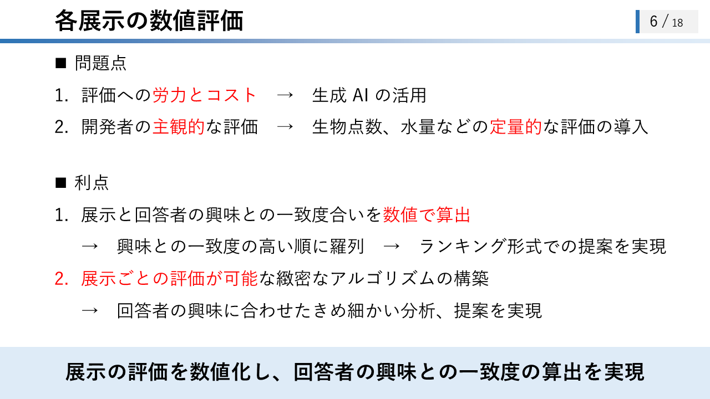
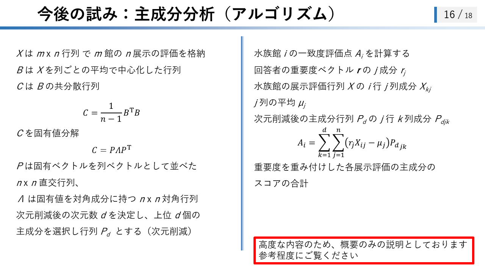

# 水族館マッチングのアルゴリズム解説

## 解説スライド

  
  
  
  
  
  
  
  
  
  
  
  
  
  
  
  
  
  

## 解説動画

[水族館マッチングアルゴリズム解説 (YouTube)](https://youtu.be/2X1YY6vnraM)  
上の解説スライドを用いた、合成音声による解説付きのアルゴリズム解説の動画です。  

<iframe width="560" height="315" src="https://www.youtube.com/embed/2X1YY6vnraM?si=EiueiuhEJGx5Gtqs" title="YouTube video player" frameborder="0" allow="accelerometer; autoplay; clipboard-write; encrypted-media; gyroscope; picture-in-picture; web-share" referrerpolicy="strict-origin-when-cross-origin" allowfullscreen></iframe>

## 水族館マッチングのアルゴリズム解説

### 1. はじめに

本稿では、回答者の興味に合致する水族館を提案する**水族館マッチングアルゴリズム**について解説します。本アルゴリズムは、事前に設定された水族館の展示評価と、回答者の回答に基づき、各水族館と回答者の興味の一致度を算出し、その結果をランキング形式で提示するものです。本稿では、アルゴリズムの概要、詳細な解説、問題点と改善案、今後の展望について説明します。

### 2. アルゴリズムの概要

水族館マッチングアルゴリズムは、以下の手順で回答者に最適な水族館を提案します。

1. **水族館展示の数値評価**: 開発者が、各水族館の展示項目を充実度に基づいて数値評価します。評価は0から5の6段階で行われ、数値が大きいほど展示が充実していることを示します。
2. **回答者の回答**: 回答者は、重視する展示と特に重視する展示を選択します。
3. **一致度計算**: 回答者の回答と水族館の展示評価に基づき、水族館ごとの一致度を計算します。
4. **マッチング結果の表示**: 一致度の高い順に水族館をランキング形式で表示します。

これにより、回答者は自身の興味に合致する水族館を効率的に見つけることが可能となります。

### 3. アルゴリズムの詳細解説

#### 3.1. 水族館展示の数値評価

各水族館の展示項目は、開発者によって充実度に基づき数値評価されます。充実度とは、展示の規模、内容の豊富さ、見応え、教育的価値などを総合的に評価したものです。評価は0から5の6段階評価とし、評価値が高いほど展示内容が充実していることを示します。

##### 3.1.1. 数値評価の問題点と利点

数値評価には、以下の問題点と利点が存在します。

**問題点:**

1. **評価作業の労力とコスト**: 全ての水族館、全ての展示項目を網羅的に評価するには、多大な労力とコストを要します。この問題に対する解決策として、生成AIの活用が考えられます。
2. **評価者の主観**: 現状の評価は開発者の主観に依存する部分が大きいため、生物の点数や水量など、より定量的な評価基準を導入することで客観性の向上が期待されます。

**利点:**

1. **興味との一致度合いの数値化**: 展示と回答者の興味の一致度を数値として算出できるため、ランキング形式での提示が可能です。これにより、回答者は自身に最適な水族館を効率的に見つけ出すことができます。
2. **緻密なアルゴリズム構築**: 展示項目ごとの詳細な評価に基づいた、きめ細かい分析と提案が可能なアルゴリズムを構築できます。

#### 3.2. 一致度の計算方法

回答者の回答と各水族館の展示評価に基づき、水族館展示と回答者の興味の一致度を計算します。

##### 3.2.1. 一致度計算の概要

一致度の計算は、以下の手順で行われます。

1. **展示の充実度、回答者の重要度、積の算出**: 各展示項目について、展示の充実度と回答者の重要度を乗じ、積を算出します。
2. **積の総和**: 全ての展示項目における積を合計し、その総和を水族館のマッチ度とします。
3. **ランキング表示**: 全水族館のマッチ度を算出し、マッチ度の高い順にランキング形式で表示します。

**表2: 一致度計算例**

| 展示項目   | 展示の充実度 ($a_{ij}$) | 回答者の重要度 ($r_j$) | 積 ($r_j \times a_{ij}$) |
| -------- | ----------------------- | ----------------------- | ------------------------- |
| イルカ   | 2                       | 1                       | 2                         |
| シャチ   | 5                       | 1.5                     | 7.5                       |
| ベルーガ | 3                       | 0                       | 0                         |
| **総和** | -                       | -                       | **9.5**                   |

表2は、一致度計算の例を示しています。この例では、総和9.5がこの水族館のマッチ度となります。

##### 3.2.2. 一致度計算の数式表現

水族館 $i$ の各展示 $j$ の評価点を $a_{ij}$、回答者の各展示 $j$ の重要度を $r_j$ とし、これらをベクトル $\mathbf{a}_i = (a_{i1}, a_{i2}, ..., a_{in})^T$、$\mathbf{r} = (r_1, r_2, ..., r_n)^T$ で表現します。ここで、$n$ は展示項目の総数です。

回答者の水族館 $i$ に対する一致度評価点 $A_i$ は、ベクトル $\mathbf{r}$ と $\mathbf{a}_i$ の内積として計算されます。

$$
A_i = \mathbf{r} \cdot \mathbf{a}_i = \sum_{j=1}^{n} r_j a_{ij}
$$

ここで、重要度 $r_j$ の設定ルールは以下の通りです。

- 重視する展示として選択: $r_j = 1$
- 特に重視する展示として選択: $r_j = 1.5$
- 重視しない展示 (未選択): $r_j = 0$

一致度評価点 $A_i$ は、回答者の重視する展示が水族館 $i$ 全体でどの程度充実しているかを示す指標となります。$A_i$ が大きいほど、水族館 $i$ が回答者の興味に合致していると評価できます。

##### 3.2.3. マッチング結果の表示

全水族館の一致度評価点 $A_i$ を計算し、評価点が高い順に水族館をランキング形式で表示します。上位5つの水族館を提示することで、回答者は効率的に最適な水族館を見つけることができます。

### 4. アルゴリズムの問題点と改善案

#### 4.1. 問題点

1. **上位水族館の固定化**: 多様な展示を高い充実度で展開する水族館が上位に固定化され、ランキング結果に面白みが欠ける可能性があります。
2. **展示評価点の上限**: 全ての展示で評価点の上限が同一（5点満点）であるため、展示内容によっては上限を拡張すべき場合があります（例: 珍しい生物の展示、大規模なショー）。

#### 4.2. 改善案

上記の課題に対し、以下の改善案を提案します。

1. **展示の珍しさに応じた重み付け**: 珍しい生物や特別な展示に対して評価の重みを大きくすることで、ランキング結果に多様性をもたらします。
2. **主成分分析の導入**: 水族館の評価データから重要な特徴を抽出する主成分分析を活用することで、より精度の高いマッチングを実現します。

##### 4.2.1. 展示の珍しさを考慮した重み付け

展示 $j$ の珍しさを表す重み $w_j$ を導入し、珍しい展示ほど評価が高くなるように調整します。重み $w_j$ は、以下の式で計算する例が考えられます。

$$
w_{j}=\log\left(\frac{N}{N_{j}}\right)+1
$$

ここで、$N$ は評価対象とした全水族館数、$N_j$ は展示 $j$ を飼育している水族館数です。$N_j$ が小さいほど $w_j$ は大きくなり、珍しい展示ほど高い重みが与えられます。

改善後の水族館 $i$ の一致度評価点 $A_i'$ は、重み $w_j$ を用いて以下のように計算されます。

$$
A_{i}=\sum w_{j}r_{j}a_{ij}
$$

この重み付けにより、展示の珍しさを考慮した、より多様で興味深いランキング結果が期待できます。

##### 4.2.2. 主成分分析の導入

主成分分析 (PCA) を用いて、水族館の評価データから本質的に重要な特徴量を抽出します。PCAは、多次元データをより少ない次元で表現し、データの特徴を捉えるための手法です。

主成分分析を用いた一致度評価点の算出には、以下の手順が含まれます。

1. **展示評価行列の作成**: 水族館の展示評価行列 $X$ を作成します（$m$ 館の水族館、$n$ 種類の展示項目）。
2. **データ中心化**: 行列 $X$ を列ごとの平均で中心化した行列 $B$ を作成します。
3. **共分散行列の算出**: 行列 $B$ の共分散行列 $C$ を算出します。  
   $$C = \frac{1}{n-1}B^{T}B$$
5. **固有値分解**: 共分散行列 $C$ を固有値分解し、$C = P \Lambda P^T$ を得ます（$P$: 固有ベクトル行列、$\Lambda$: 固有値対角行列）。  
   $$C = P\Lambda P^{T}$$
7. **次元削減**: 上位 $d$ 個の主成分を選択し、行列 $P_d$ を作成します。
8. **一致度評価点の算出**: 次元削減後の主成分 $P_d$ を用いて、水族館 $i$ の一致度評価点 $A_i$ を算出します。  
   $$A_{i}=\sum_{k=1}^{d}\sum_{j=1}^{n}(r_{j}X_{ij}-\mu_{j})P_{djk}$$  
      $$A_i$$: 水族館 $$i$$ の一致度評価点  
      $$d$$: 次元削減後の次元数（上位 $$d$$ 個の主成分を使用）  
      $$n$$: 展示項目の総数  
      $$r_{j}$$: 回答者の展示 $$j$$ に対する重要度  
      $$X_{ij}$$: 水族館 $$i$$ の展示 $$j$$ の評価点  
      $$\mu_{j}$$: 全水族館における展示 $$j$$ の評価点の平均値 ( $$j$$ 列の平均)  
      $$P_{djk}$$: 次元削減後の主成分行列 $$P_d$$ の $$j$$ 行 $$k$$ 列成分  

主成分分析を導入することで、評価データに含まれるノイズを低減し、データが潜在的に持つ重要な特徴に基づいた、より高度なマッチングアルゴリズムが実現できると期待されます。具体的な一致度評価点 $A_i$ の算出式は高度となるため、ここでは概要のみに留めます。

### 5. まとめと今後の展望

本稿では、水族館展示の評価値と回答者の重視する展示項目に基づき、回答者にとって最適な水族館を提案する水族館マッチングアルゴリズムについて解説しました。このアルゴリズムにより、利用者の水族館選びを効果的にサポートできる可能性が示されました。

今後の展望として、アルゴリズムの継続的なアップデートを行い、より多くの方に利用していただけるよう改善を進めていきます。具体的には、以下の項目を予定しています。

- 対応水族館の拡充
- 洗練されたUIの構築
- 水族館情報の詳細な追加
- 地域別表示機能の実装
- 評価基準の継続的な改善

これらのアップデートを通じて、水族館マッチングの利便性と精度を向上させ、より多くのユーザーに価値を提供できるよう努めてまいります。

**謝辞**

本アルゴリズムの作成にあたり、しゃち様より多大なご協力を賜りました。ここに心より感謝申し上げます。
